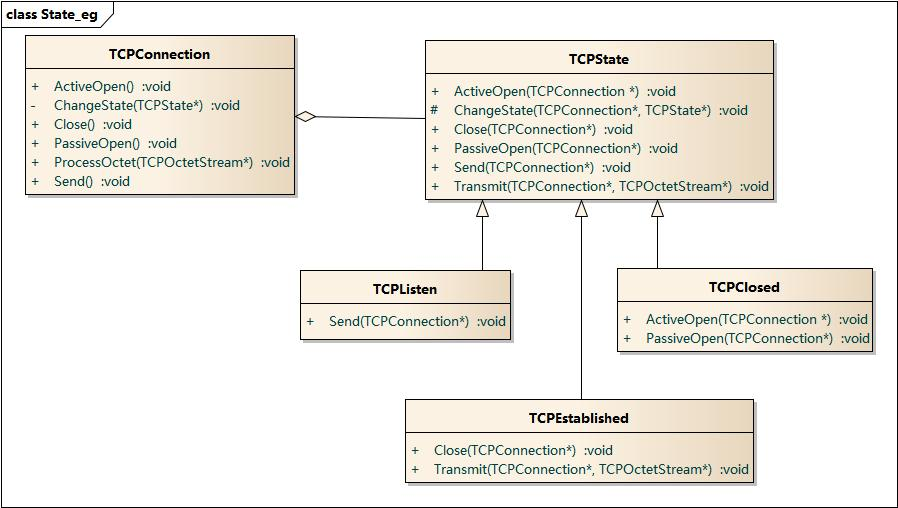
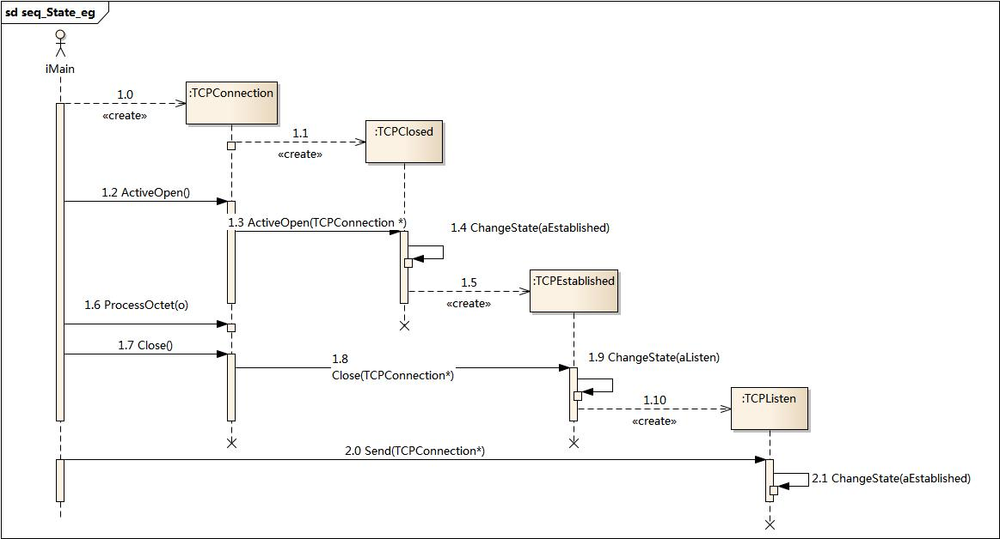

状态模式
========

模式动机
--------

-   在很多情况下，一个对象的行为取决于一个或多个动态变化的属性，这样的属性叫做状态，这样的对象叫做有状态的(stateful)对象，这样的对象状态是从事先定义好的一系列值中取出的。当一个这样的对象与外部事件产生互动时，其内部状态就会改变，从而使得系统的行为也随之发生变化。
-   在UML中可以使用状态图来描述对象状态的变化。

模式定义
--------

状态模式(State Pattern)
：允许一个对象在其内部状态改变时改变它的行为，对象看起来似乎修改了它的类。其别名为状态对象(Objects
for States)，状态模式是一种对象行为型模式。

模式结构
--------

状态模式包含如下角色：

-   Context: 环境类
-   State: 抽象状态类
-   ConcreteState: 具体状态类

时序图
------

既然是状态模式，加上状态图，对状态转换间的理解会清晰很多：

代码分析
--------

运行结果：

模式分析
--------

-   状态模式描述了对象状态的变化以及对象如何在每一种状态下表现出不同的行为。
-   状态模式的关键是引入了一个抽象类来专门表示对象的状态，这个类我们叫做抽象状态类，而对象的每一种具体状态类都继承了该类，并在不同具体状态类中实现了不同状态的行为，包括各种状态之间的转换。

在状态模式结构中需要理解环境类与抽象状态类的作用：

-   环境类实际上就是拥有状态的对象，环境类有时候可以充当状态管理器(State
    Manager)的角色，可以在环境类中对状态进行切换操作。
-   抽象状态类可以是抽象类，也可以是接口，不同状态类就是继承这个父类的不同子类，状态类的产生是由于环境类存在多个状态，同时还满足两个条件：
    这些状态经常需要切换，在不同的状态下对象的行为不同。因此可以将不同对象下的行为单独提取出来封装在具体的状态类中，使得环境类对象在其内部状态改变时可以改变它的行为，对象看起来似乎修改了它的类，而实际上是由于切换到不同的具体状态类实现的。由于环境类可以设置为任一具体状态类，因此它针对抽象状态类进行编程，在程序运行时可以将任一具体状态类的对象设置到环境类中，从而使得环境类可以改变内部状态，并且改变行为。

实例
----

TCPConnection

这个示例来自《设计模式》,展示了一个简化版的TCP协议实现;
TCP连接的状态有多种可能，状态之间的转换有相应的逻辑前提；
这是使用状态模式的场合；

状态图：

结构图：

时序图：

优点
----

状态模式的优点

-   封装了转换规则。
-   枚举可能的状态，在枚举状态之前需要确定状态种类。
-   将所有与某个状态有关的行为放到一个类中，并且可以方便地增加新的状态，只需要改变对象状态即可改变对象的行为。
-   允许状态转换逻辑与状态对象合成一体，而不是某一个巨大的条件语句块。
-   可以让多个环境对象共享一个状态对象，从而减少系统中对象的个数。

缺点
----

状态模式的缺点

-   状态模式的使用必然会增加系统类和对象的个数。
-   状态模式的结构与实现都较为复杂，如果使用不当将导致程序结构和代码的混乱。
-   状态模式对“开闭原则”的支持并不太好，对于可以切换状态的状态模式，增加新的状态类需要修改那些负责状态转换的源代码，否则无法切换到新增状态；而且修改某个状态类的行为也需修改对应类的源代码。

适用环境
--------

在以下情况下可以使用状态模式：

-   对象的行为依赖于它的状态（属性）并且可以根据它的状态改变而改变它的相关行为。
-   代码中包含大量与对象状态有关的条件语句，这些条件语句的出现，会导致代码的可维护性和灵活性变差，不能方便地增加和删除状态，使客户类与类库之间的耦合增强。在这些条件语句中包含了对象的行为，而且这些条件对应于对象的各种状态。

模式应用
--------

状态模式在工作流或游戏等类型的软件中得以广泛使用，甚至可以用于这些系统的核心功能设计，如在政府OA办公系统中，一个批文的状态有多种：尚未办理；正在办理；正在批示；正在审核；已经完成等各种状态，而且批文状态不同时对批文的操作也有所差异。使用状态模式可以描述工作流对象（如批文）的状态转换以及不同状态下它所具有的行为。

模式扩展
--------

共享状态

-   在有些情况下多个环境对象需要共享同一个状态，如果希望在系统中实现多个环境对象实例共享一个或多个状态对象，那么需要将这些状态对象定义为环境的静态成员对象。

简单状态模式与可切换状态的状态模式
:   1)  简单状态模式：简单状态模式是指状态都相互独立，状态之间无须进行转换的状态模式，这是最简单的一种状态模式。对于这种状态模式，每个状态类都封装与状态相关的操作，而无须关心状态的切换，可以在客户端直接实例化状态类，然后将状态对象设置到环境类中。如果是这种简单的状态模式，它遵循“开闭原则”，在客户端可以针对抽象状态类进行编程，而将具体状态类写到配置文件中，同时增加新的状态类对原有系统也不造成任何影响。
    2)  可切换状态的状态模式：大多数的状态模式都是可以切换状态的状态模式，在实现状态切换时，在具体状态类内部需要调用环境类Context的setState()方法进行状态的转换操作，在具体状态类中可以调用到环境类的方法，因此状态类与环境类之间通常还存在关联关系或者依赖关系。通过在状态类中引用环境类的对象来回调环境类的setState()方法实现状态的切换。在这种可以切换状态的状态模式中，增加新的状态类可能需要修改其他某些状态类甚至环境类的源代码，否则系统无法切换到新增状态。

总结
----

-   状态模式允许一个对象在其内部状态改变时改变它的行为，对象看起来似乎修改了它的类。其别名为状态对象，状态模式是一种对象行为型模式。
-   状态模式包含三个角色：环境类又称为上下文类，它是拥有状态的对象，在环境类中维护一个抽象状态类State的实例，这个实例定义当前状态，在具体实现时，它是一个State子类的对象，可以定义初始状态；抽象状态类用于定义一个接口以封装与环境类的一个特定状态相关的行为；具体状态类是抽象状态类的子类，每一个子类实现一个与环境类的一个状态相关的行为，每一个具体状态类对应环境的一个具体状态，不同的具体状态类其行为有所不同。
-   状态模式描述了对象状态的变化以及对象如何在每一种状态下表现出不同的行为。
-   状态模式的主要优点在于封装了转换规则，并枚举可能的状态，它将所有与某个状态有关的行为放到一个类中，并且可以方便地增加新的状态，只需要改变对象状态即可改变对象的行为，还可以让多个环境对象共享一个状态对象，从而减少系统中对象的个数；其缺点在于使用状态模式会增加系统类和对象的个数，且状态模式的结构与实现都较为复杂，如果使用不当将导致程序结构和代码的混乱，对于可以切换状态的状态模式不满足“开闭原则”的要求。
-   状态模式适用情况包括：对象的行为依赖于它的状态（属性）并且可以根据它的状态改变而改变它的相关行为；代码中包含大量与对象状态有关的条件语句，这些条件语句的出现，会导致代码的可维护性和灵活性变差，不能方便地增加和删除状态，使客户类与类库之间的耦合增强。

